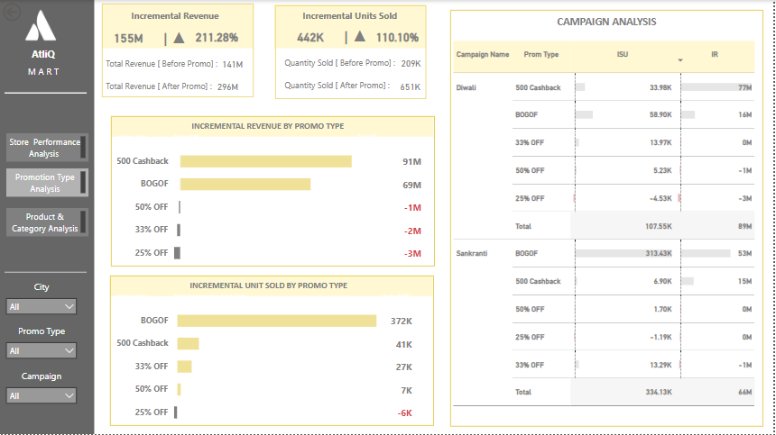
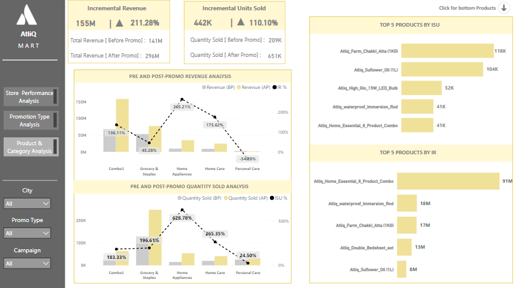

## About The Project
The project is about an imaginary retail giant called AtliQ Mart.

AtliQ Mart is a retail giant with over 50 supermarkets in the southern region of India. All their 50 stores ran a massive promotion during the Diwali 2023 and Sankranti 2024(festive time in India) on their AtliQ branded products.

Through this exercise the sales director wants to understand which promotions did well and which did not so that they can make informed decisions for their next promotional period.

)

